[中文](README_CN.md) | **English**

# LLM Trainer

A beginner-friendly tool for training your own language model — no coding experience required.

## Download

Go to the [Releases](https://github.com/mr-jay-wei/llm_trainer/releases) page to download the latest version.

## Why This Project?

Setting up ML environments is painful. Reading framework source code is confusing. Training your own model feels impossible. **LLM Trainer** solves all three.

## Screenshots

- Startup & Training Interface

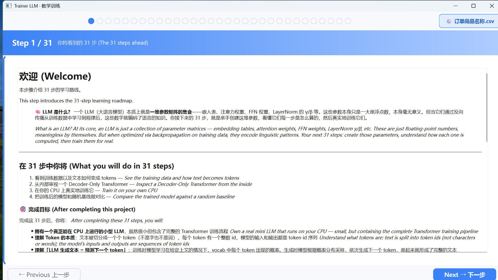
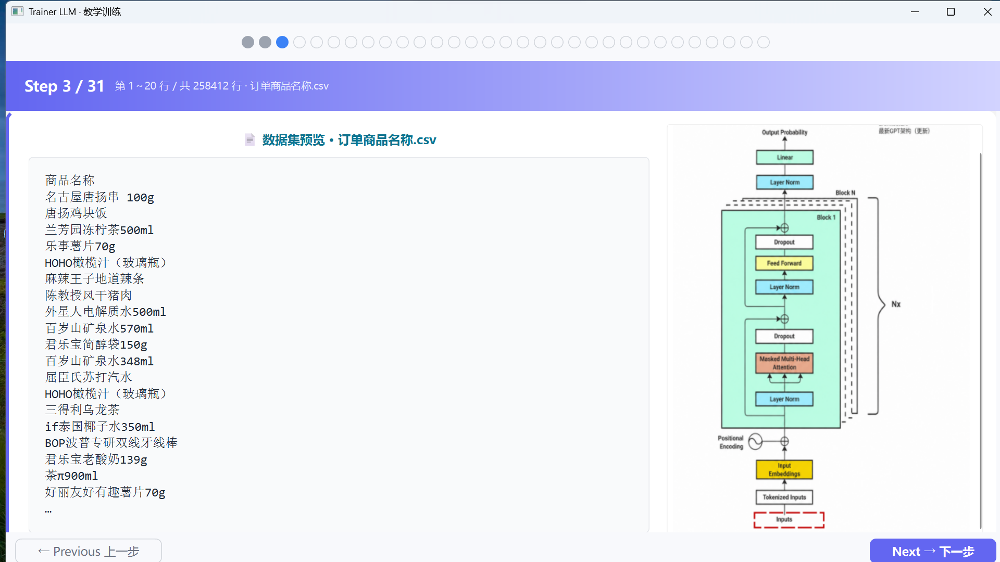
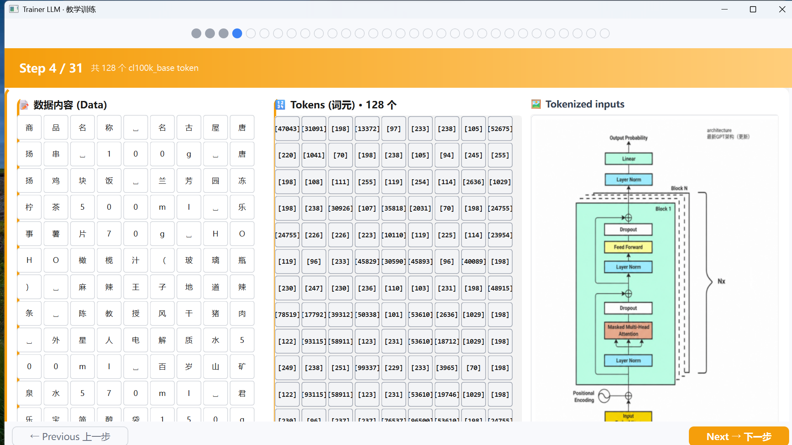
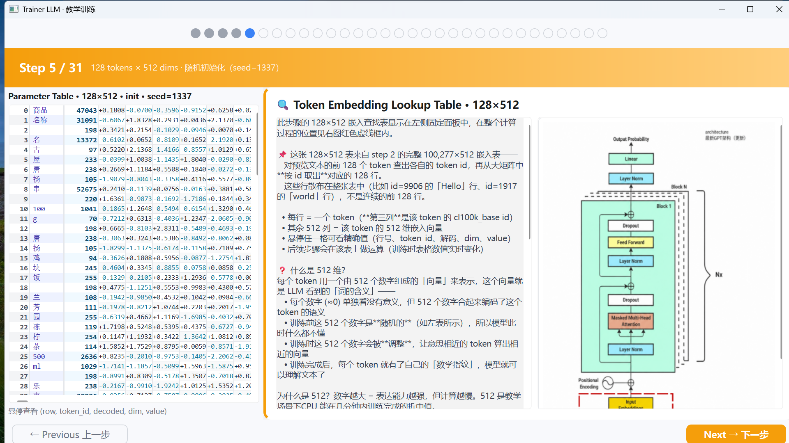
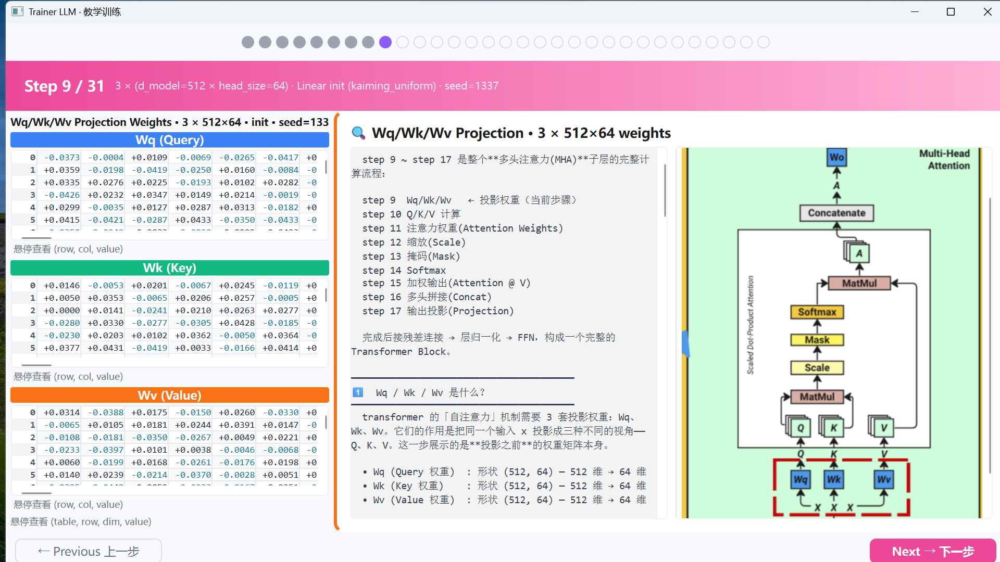
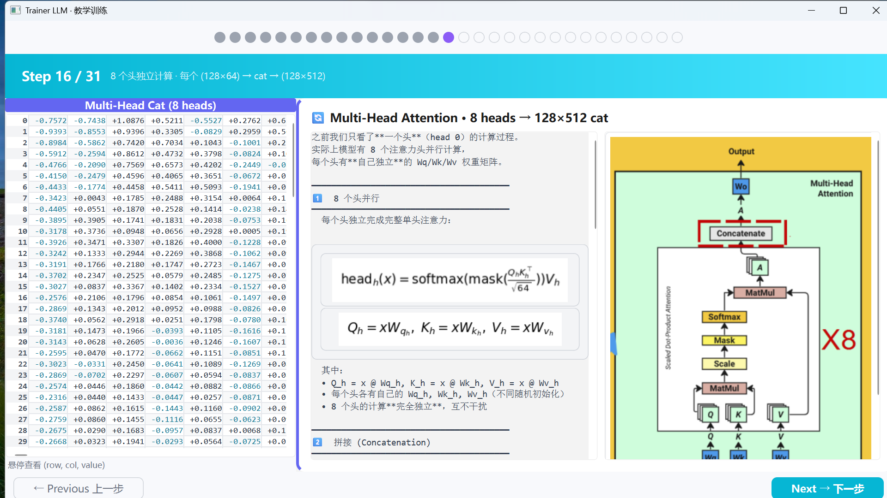
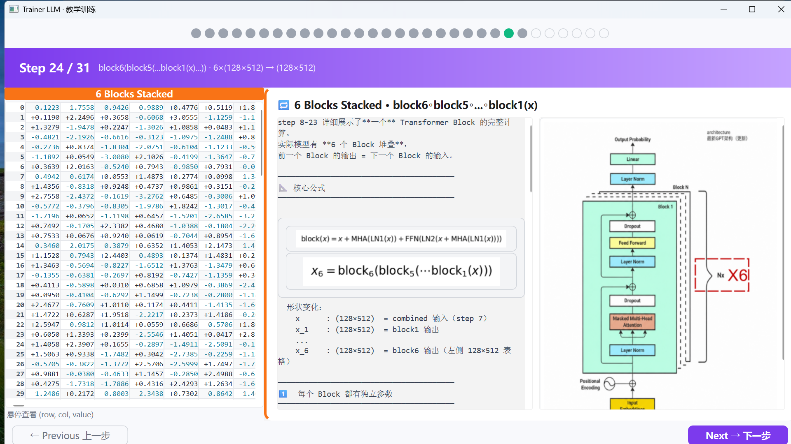
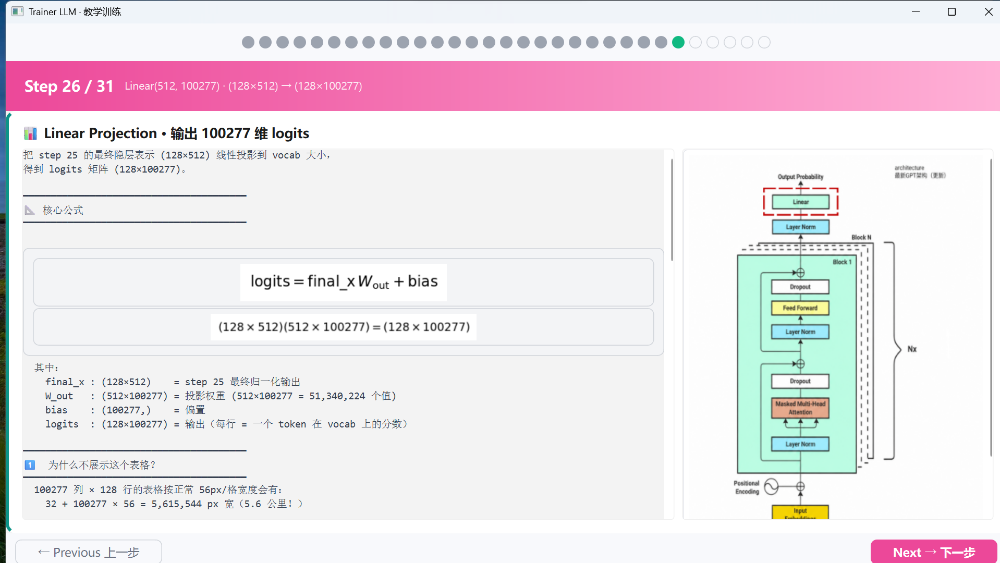
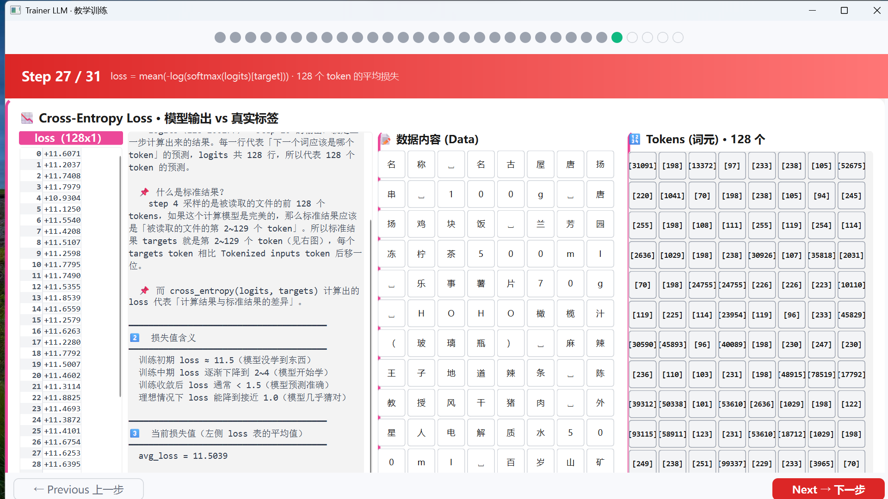
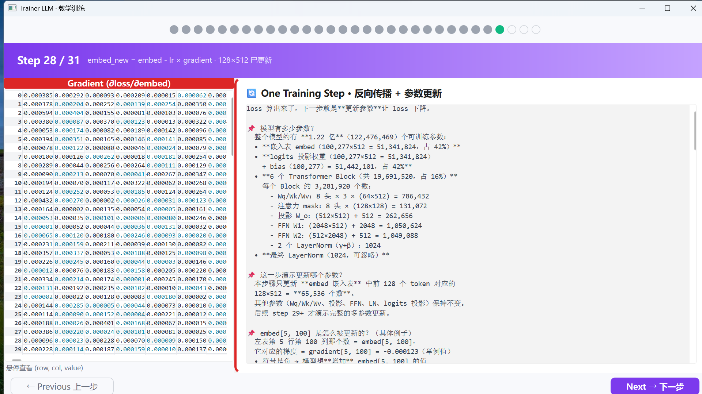

- Loss Curve During Training

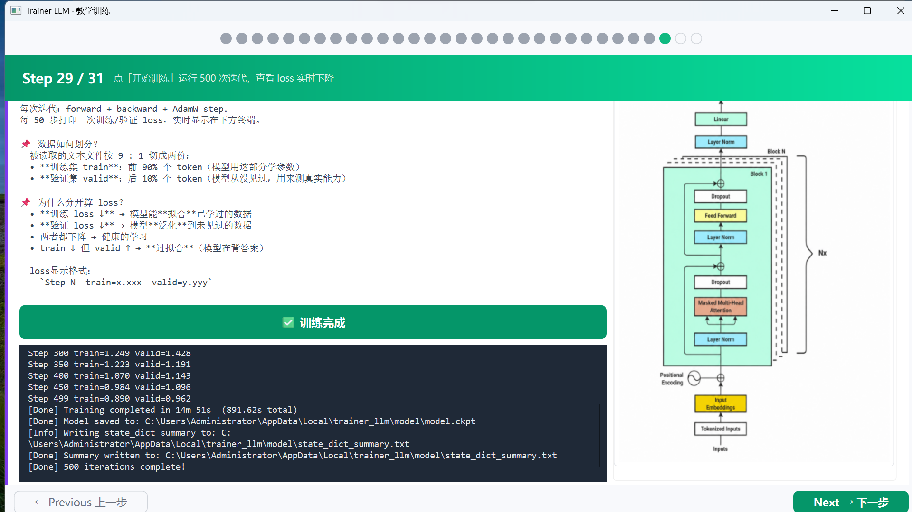

- Before vs After Training Comparison

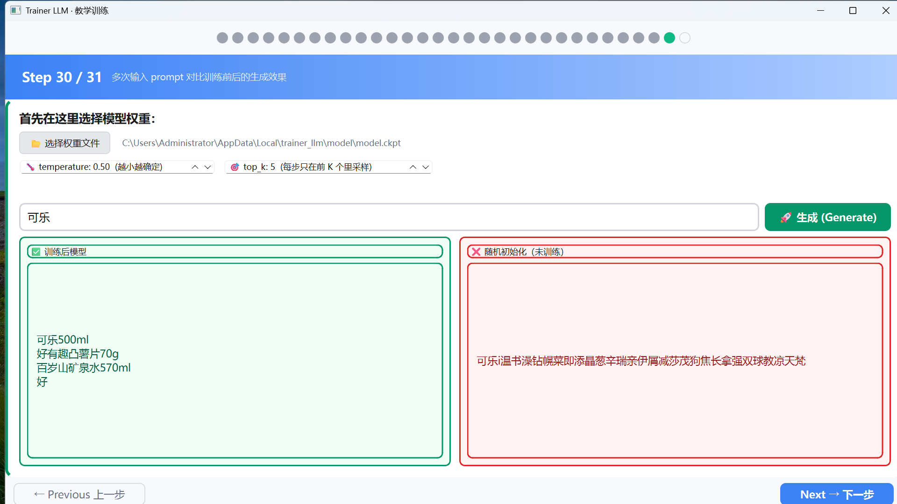

## Quick Start

1. Download the zip from [Releases](https://github.com/mr-jay-wei/llm_trainer/releases)
2. Extract to a path without spaces (e.g. `D:\trainer_llm\`)
3. Double-click `trainer_llm.exe`
4. Follow Steps 1 → 2 → 3 → 4 on the interface
5. Prepare your data in CSV format
6. Click "Start Training" and wait for completion

## Technical Overview

- Decoder-only Transformer architecture
- Pre-training + fine-tuning pipeline
- 6 layers, 512 hidden dimensions, ~0.1B parameters

## What You'll Learn After Training

### 1. What Is a Large Language Model?

> **LLM = Weights + Architecture + Tokenizer + Training Data Distribution**

- It's not just a "weights file" — the architecture defines how parameters are computed
- Same weights + different architecture = completely different model
- The tokenizer determines the text ↔ token ID mapping

### 2. What Training Actually Does

```
Randomly initialized Embedding (100277 × 512)
    ↓
Each forward pass: lookup → attention → predict next token
    ↓
Compute loss (prediction vs ground truth)
    ↓
Backpropagation: update the Embedding rows used
    ↓
After 500 steps: similar tokens move closer in vector space
```

**Key insight**: Training doesn't "teach knowledge" — it **optimizes the vector space** so co-occurring tokens get closer in 512-dimensional space.

### 3. The Essence of Attention

```
Q · K^T = "query-key similarity" = which positions should attend to which

Not semantic similarity, but task-driven dynamic association:
- "it" Q ≈ "apple" K  →  coreference resolution
- "eat" Q ≈ "apple" K →  action-object relationship
```

### 4. Key Hyperparameters Explained

| Parameter | What You Learn |
|-----------|---------------|
| **d_model=512** | Each token is represented by 512 floats |
| **num_heads=8** | 8 independent attention patterns (syntax, semantics, coreference, etc.) |
| **context_length=128** | Max context the model can "see" at once |
| **dropout=0.1** | Randomly disable 10% of neurons during training to prevent overfitting |
| **Kaiming Uniform** | Weight initialization must account for ReLU variance loss |

### 5. What Loss Values Mean

| Loss | P(correct word) | Stage |
|------|-----------------|-------|
| 11.5 | 0.001% | Completely random (ln 100277) |
| 6.0 | 0.25% | Learning statistical patterns |
| 3.0 | 5% | Can guess the general category |
| 1.0 | 37% | Confident about the correct word |

**Key insight**: Loss has no absolute good/bad — it depends on vocabulary size. With a 100K vocab, loss=3 is already good.

### 6. Parameter Count vs Model Capability

```
Your model: 0.12B (122M parameters)
    ├─ Embedding + output layer: 84% (dominated by vocab)
    ├─ 6-layer Transformer: 15% (actual learning capacity)
    └─ LayerNorm + Bias: 1%

Comparison:
    GPT-1: 117M (same tier)
    GPT-2 small: 124M (same tier)
    GPT-3: 175B (1430× yours)
```

### 7. Why It Runs on CPU

- 0.12B parameters × float32 ≈ 464 MB
- AdamW optimizer states ≈ 1.5 GB
- Total < 2 GB RAM — any laptop can handle it

### 8. From "Using" to "Understanding"

```
Before:  pip install transformers, call model.generate()
    ↓
Now:     You know what generate() does internally:
         1. Get logits from the last token
         2. Divide by temperature to adjust randomness
         3. Top-k pruning of candidate set
         4. Softmax to probabilities
         5. Multinomial sampling
         6. Append to sequence, repeat
```

## Contact

- WeChat: xiaofeng_0209
- QQ: 854326781
- Email: jingfeng_wei@163.com
